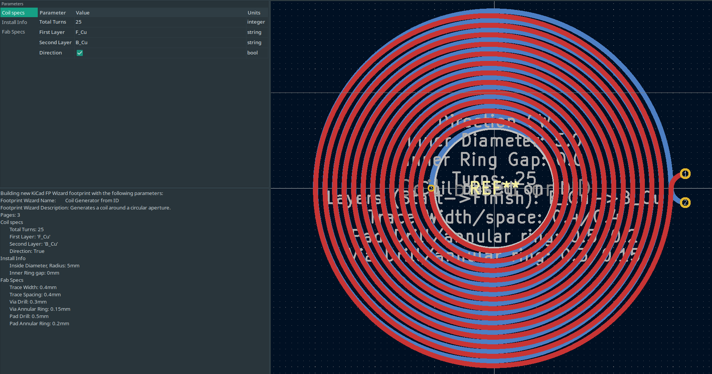
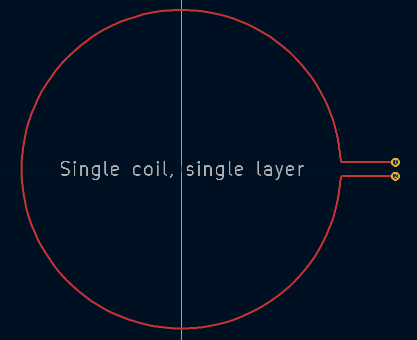
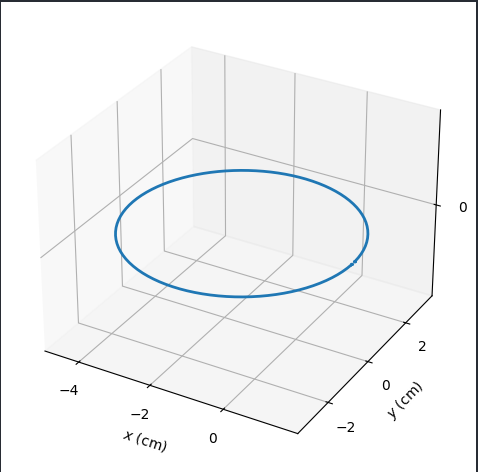
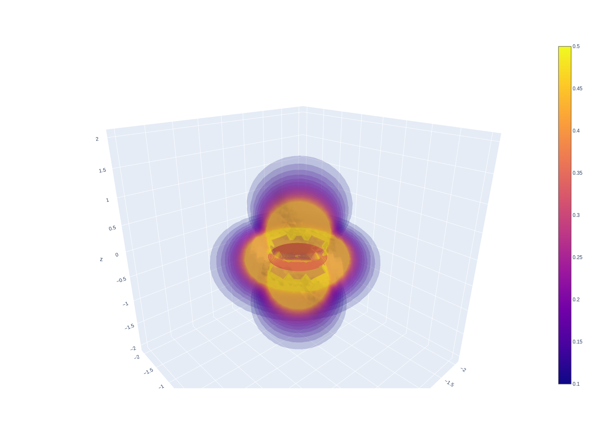

# Question 1 : Are halbach array really usefull in our case ?

[https://www.duramag.com/techtalk/halbach-arrays/benefits-and-drawbacks-to-using-halbach-arrays/](https://www.duramag.com/techtalk/halbach-arrays/benefits-and-drawbacks-to-using-halbach-arrays/)

# Question 2 : Compute the distance a magnet could be attracted at, using a certain coil.
- Need to compute the magnetic field (B) generated by a coil with a specific current at a specific spot.
- Get the magnet's moment (m) and the distance, looks like we can get it from datasheet or by calculating it. [https://www.e-magnetica.pl/doku.php/magnetic_dipole_moment](https://www.e-magnetica.pl/doku.php/magnetic_dipole_moment)
- Should be able to compute the force from the coil on the magnet
- Shear force is different from adhesion force [https://www.supermagnete.ch/fre/faq/Quelle-est-la-difference-entre-force-d-adherence-et-force-de-cisaillement-force-de-deplacement#ou-pourquoi-mon-aimant-au-mur-ne-supporte-pas-le-poids-maximal-](https://www.supermagnete.ch/fre/faq/Quelle-est-la-difference-entre-force-d-adherence-et-force-de-cisaillement-force-de-deplacement#ou-pourquoi-mon-aimant-au-mur-ne-supporte-pas-le-poids-maximal-)

# Question 3 : Influence of the coil's shape on the magnetic field
- More turn means more magnetic field but also more resistance thus less current for the same voltage.
- The shape of the coil seems to influence the magnetic field, look for sources ?
- The coil's shape also influences the direction of the magnetic field, could we use that to our advantage ?

# Question 4 : Are linear line coils optimal ?
- The movement are freeer in linear line coils, but it would be harder to know where the magnet exactly are and it would be harder, not to grab other magnets when moving any one.

# MAGNETS

[https://www.supermagnete.ch/fre/aimants-disques-neodyme/disque-magnetique-10mm-1.5mm_S-10-1.5-N](https://www.supermagnete.ch/fre/aimants-disques-neodyme/disque-magnetique-10mm-1.5mm_S-10-1.5-N)

# COIL GENERATION IN KICAD
We can use a simple plugin integrated in Kicad to generate a coil with desired parameters. 

## Simulation
With the help of `kiutils` library, we can export the points forming the footprints of the coil.

> Here's an image of a simple coil with only 1 turn.
> 

## Helmholtz coils

[https://en.wikipedia.org/wiki/Helmholtz_coil](https://en.wikipedia.org/wiki/Helmholtz_coil)

# GENERAL sources
[Encyclopedia](https://www.e-magnetica.pl/doku.php/start)

[Selfmoving Chess Piece Pawn Makes Room](https://www.youtube.com/shorts/qu3ETY4ECMg
)

[Lab 5: The Biot-Savart law - magnetic
fields due to current carrying coils](http://www.yorku.ca/marko/PHYS2211/Lab5.pdf)

[Lorentz Force Law and Biot-Savart](https://andrealommen.github.io/PHY309/lectures/lorentz)