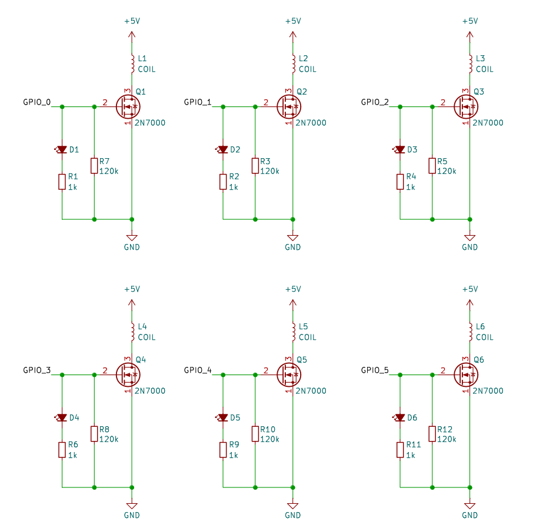
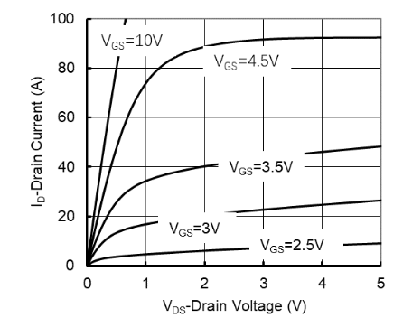

# Breadboard proto for linear coils tests

I've made a simple schematics and mounted it on a breadboard to test the coils.




I mounted it with some 2N7000 Q1 N-Channel MOSFETs, controlled via a Raspberry Pi Pico.

```py
import digitalio
import board
import time


pins = [board.GP0, board.GP1, board.GP2, board.GP3, board.GP4, board.GP5, ]

coils = [digitalio.DigitalInOut(pin) for pin in pins]

for coil in coils:
	coil.direction = digitalio.Direction.OUTPUT

coils[3].value = True


print("STARTING TEST")
while True:
	# Set coils 0 to 2 to true one at the time
	for i in range(3):
		coils[i].value = True
		print(f"Coil {i} ON")
		time.sleep(0.3)
		coils[i].value = False
		print(f"Coil {i} OFF")

```

I could see the magnet jitter a bit but without moving, I tried cranking the power up. But aparts from heating more, it did not move better. The fets were getting hot because they were not dimensioned for the current. So i tried with bigger ones. 


I then tried with IRLZ14 N-Channel MOSFETs, but the results were the same. I stopped the test to avoid damaging the power supply and the transistors because i did not have proper flyback diodes.


# Began schematics with driver + flyback diodes and round coils

## Needs
I need:
- Big transistors capable of handling the current
- Flyback diodes to protect over voltage
- Series diodes with the coils to protect the power supply from the back EMF
- Optocouplers to isolate the driver from the Raspberry Pi Pico

## Choices

### Transistors MDD50N03D

I chose the MDD50N03D N-Channel MOSFETs:
- 38 W power dissipation
- 50 A continuous drain current
- 150 A pulsed drain current
- 30 V drain-source voltage




With a VGS of 3.3V outputed by the, we can obtain around 20 Amps of current with 0 ohm resistance...

