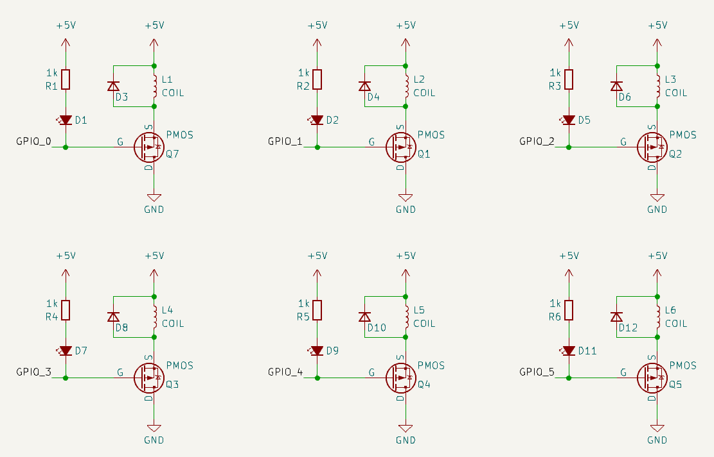
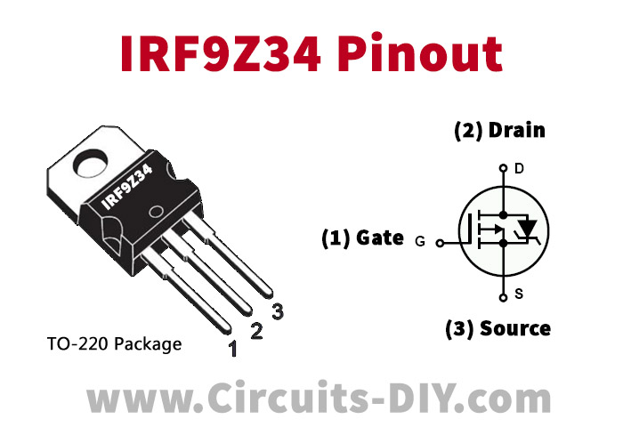
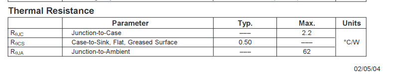
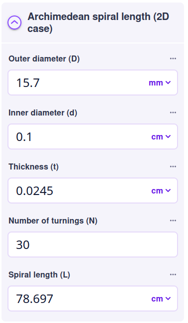
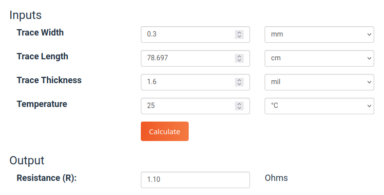

# Breadboard proto for linear coils with diodes

I just noticed that the transistors i was using were mixed and some of them were PMOS and others NMOS... 

I remade the schematics and mounted it on a breadboard to test the coils with only the PMOS, sadly...

PMOS is the **IRF9Z34**. 




Pinout of the PMOS : 



The magnet is moving with a delay of 0.3 between each coil activation. On the small board from PEMi Tech.

[https://hackaday.io/project/154496-2d-actuator-move-micro-robot-in-xy-2d-space](https://hackaday.io/project/154496-2d-actuator-move-micro-robot-in-xy-2d-space)

```py
import digitalio
import board
import time

pins = [board.GP0, board.GP1, board.GP2, board.GP3, board.GP4, board.GP5, ]

coils = [digitalio.DigitalInOut(pin) for pin in pins]

for coil in coils:
	coil.direction = digitalio.Direction.OUTPUT

coils[3].value = True


print("STARTING TEST")
while True:
	# Set coils 0 to 2 to true one at the time
	for i in range(3):
		coils[i].value = False
		print(f"Coil {i} ON")
		time.sleep(0.3)
		coils[i].value = True
		print(f"Coil {i} OFF")
```

But it's moving quiete poorly at low power: 5V (depending on the resistance)

When i crank the power up (10V and the coils draw about 1A), the magnet is moving better but the transistors are getting really hot and i have to stop the test to avoid damaging them.

From what i calculated, with 10V and 1A, the power dissipated by the transistors is 10W.



With this transistor, with a junction to ambient resistance of about 60 °C/W, the temperature should get to more than 600°C lol   


# Old PCB testing

I detached on part of the old PCB to test the it. It was not maintained properly,there was hot glue holding it together and some wires were soldered by hand


# PCB design

## Resistance of the round coils

In order to get a proper transistor that can handle the power, i need to know the resistance of the coils.

I compute the lenght of the spiral with the archimedean spiral formula on a website [https://www.omnicalculator.com/math/spiral-length](https://www.omnicalculator.com/math/spiral-length):



We have a lenght of `78.697` cm for the spiral.

I can now compute the approximate resistance with an online calculator [https://www.allaboutcircuits.com/tools/trace-resistance-calculator/](https://www.allaboutcircuits.com/tools/trace-resistance-calculator/)





The resistance is about `1.1 ohm`. Taking the via and traces coming to the coil into account, i can approximate the resistance to maximum `10 ohms` and minimum `1 ohm`.

We want to have a maximum amount of power in the coil while still not burning the transistors.

From what i've seen, power transistors have a junction to ambient resistance 


