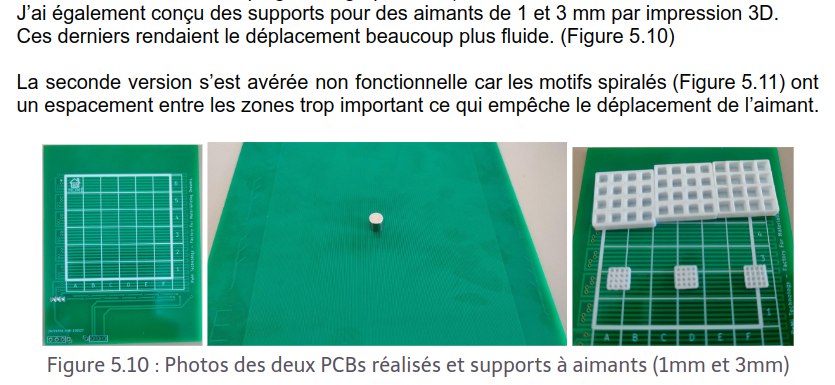
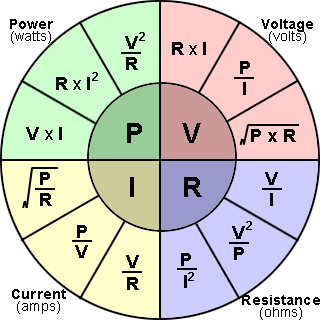
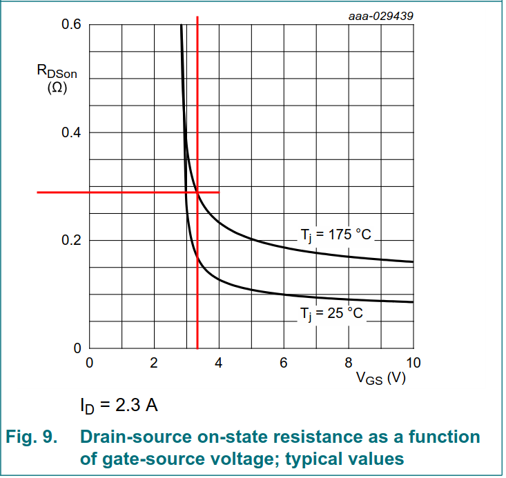

The 8mm circle magnets only move when applying massive power to the coils (50W...) and i cannot test properly since the transistors are getting really hot.

The 2mm square magnets are moving with 20W but the transistors are getting hot too.

# Solution 1
Find a transistor system that can handle the power, maybe add a heatsink.

# Solution 2
Find smaller magnet (preferably circle) that can be moved with less power. 

# Solution 3 ?
Multiple magnets in a 3d printed piece ? rom what

# Insane planar motors from Rockwell

[Video demo planar motor](https://www.youtube.com/watch?v=xM1i5vORH4k)

[Actual planar motor site](https://planarmotor.com/en/overview)

# Some papers about 2d XY planar motors
[Papers directory](PAPERS/)

# PCB Specifications

- 2 or 4 layer board depending on possible thickness
- 6 driver transistors
- 4 different coil designs for testing
- Each design can access the 6 transistors
- 10x10mm coil areas

## Coil design 1
- Only 2 different coils per layer (A and B for layer 1 and C, D for layer 2 same as bobricius)
- **10** mils gaps and **20** mils traces (same as bobricius)

## Coil design 2
- 3 different coils per layer (A, B, C for layer 1 and D, E, F for layer 2)
- **10** mils gaps and **20** mils traces (same as bobricius)

## Coil design 3
- Only 2 different coils per layer (A and B for layer 1 and C, D for layer 2 same as bobricius)
- **10** mils gaps and **40** mils traces (same as bobricius)

## Coil design 4
- Only 2 different coils per layer (A and B for layer 1 and C, D for layer 2 same as bobricius)
- **40** mils gaps and **40** mils traces (same as bobricius)

# Components choice

## Transistors

With the `BUK6D120-40EX` transistor, rdson at 250 ohm:

