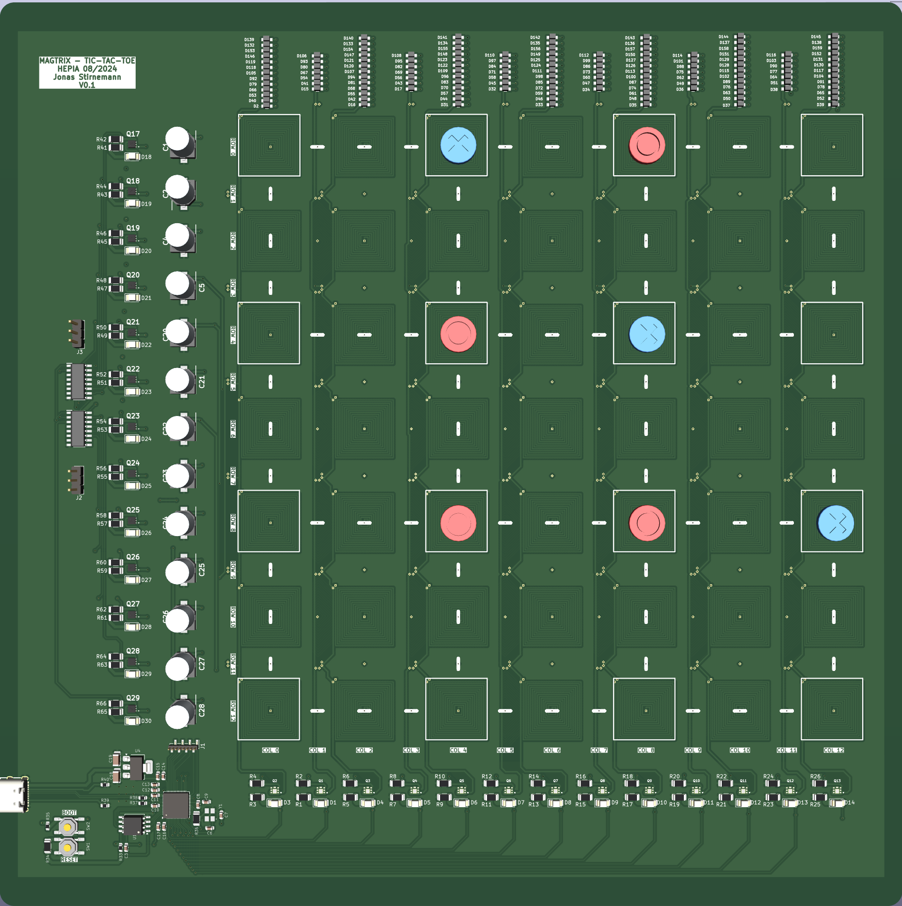
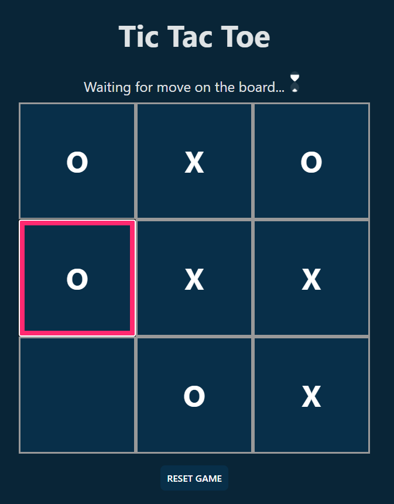

# Tic Tac Toe Board Game

PCB design for a Tic Tac Tie game. The game is played on a 3x3 grid, where the players have to align 3 of their pieces in a row, column or diagonal to win. The pieces are actual magnets that are moved by activating coils etched on the PCB.

## Front end

The front end in React will display the game board and let the users play the game. The code can be found in [src/web/tictactoe/frontend](src/web/tictactoe/frontend)

## Back end

The back end in Python will handle the communication with the actual board to tell it to make the moves and wait for an acknowledgement. The code can be found in [src/web/tictactoe/backend](src/web/tictactoe/backend)

## MCU Firmware

The firmware for the MCU will handle the communication with the back end to receive the moves. It will control the coils to move the pieces and tell the backend back when the move is done. The code can be found in [src/mcu/tictactoe](src/mcu/tictactoe)

## PCB

The PCB design is made in KiCad and can be found in [pcb/magtrix](pcb/magtrix)

Here's the schematics:

[docs/images/magtrix.pdf](docs/images/magtrix.pdf)

